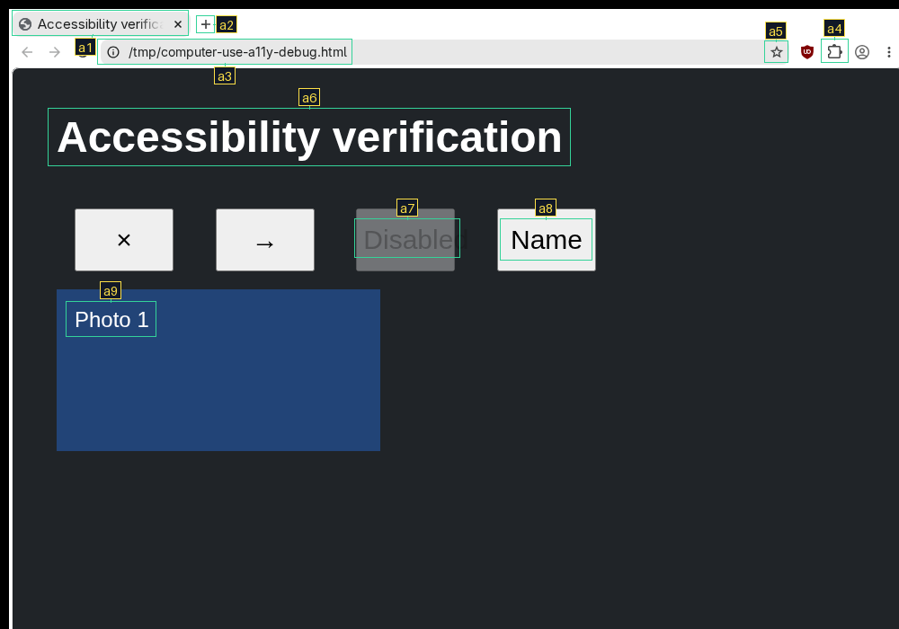
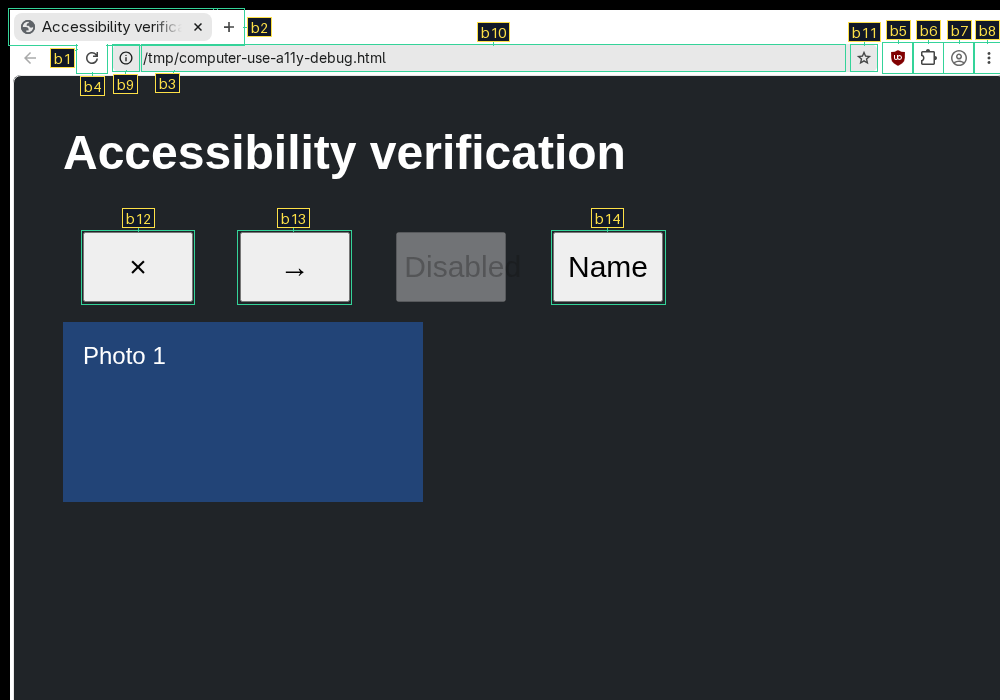
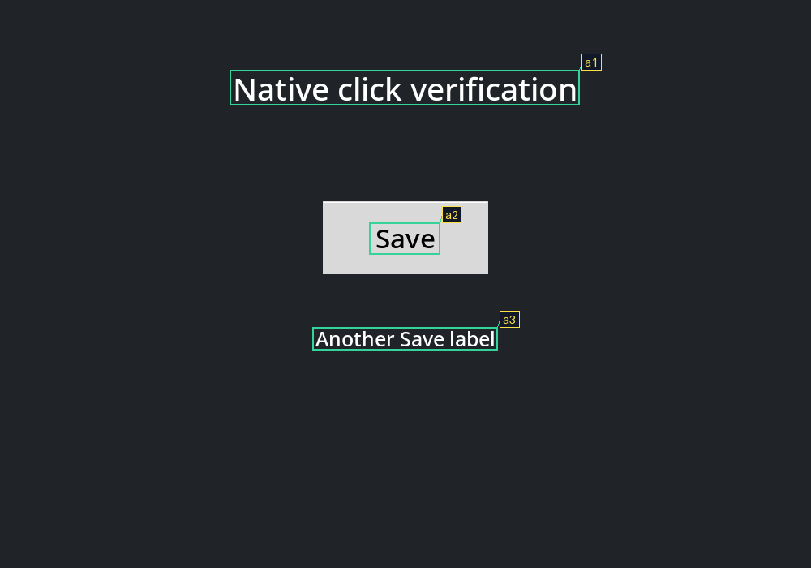
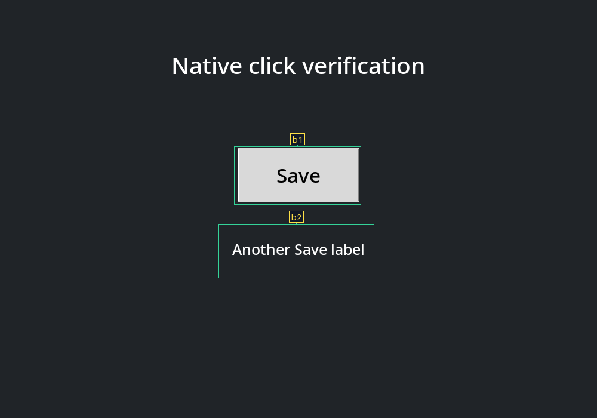

# computer-use

Native X11 desktop automation on a private virtual display, with native accessibility targets by default and optional local OCR and icon detection. Screenshots show letter-number badges; commands can query their coordinates or click their centers without browser instrumentation.

| Optional OCR text targets | Default accessibility targets |
|---|---|
|  |  |

## Setup

Requires Linux, user systemd, Python 3, Xvfb, xauth, xdpyinfo, xdg-dbus-proxy, ImageMagick, xdotool and the native accessibility dependencies below. Clipboard commands additionally use xclip; the browser convenience uses helium-browser. Optional OCR/icon setup uses uv.

```bash
mkdir -p ~/.local/bin
ln -s "$PWD/scripts/computer_use.py" ~/.local/bin/computer-use
ln -s "$PWD/scripts/virtual_browser.py" ~/.local/bin/virtual-browser
computer-use setup-accessibility
```

Keep the entire repository directory together: the entry points import sibling modules. For an existing installation, update its directory link or relink both commands to this checkout; copying only the entry-point file is unsupported. The default accessibility mode checks native system dependencies with `setup-accessibility`; see the requirements below. For optional text targets, `setup-ocr` creates a separate Python 3.12 environment under `~/.local/share/computer-use/ocr-venv` and installs the complete dependency lock and prepares the models selected by the pinned RapidOCR release. Setup can download packages and model weights. Screenshot inference runs locally on CPU; images are never sent to an OCR service. Each desktop starts its own resident worker lazily and owns its cleanup.

## Capture, locate, click

```bash
computer-use start demo --size 1440x1000
computer-use launch demo --id app -- your-x11-app
computer-use screenshot demo --output /tmp/screen.png
# View the image, then choose a badge:
computer-use query demo @a13
computer-use click demo @a13
computer-use screenshot demo --output /tmp/after.png
computer-use stop demo
```

Screenshots print only the image path. Target names and geometry stay in the owner-only session directory. `query` prints one target as JSON: `ref`, `text`, `confidence`, `bounds`, `center`, and source-image information. Bounds are `[x1, y1, x2, y2]` with exclusive right/bottom edges; center is `[x, y]`, all in original screenshot pixels from the top left. The default bounds describe accessible controls; `--targets text` returns OCR text bounds instead.

References advance through `@a1`, `@b1`, …, `@g1`, then wrap. A new capture replaces the reference map; all `input`, `exec`, launch/browser, clipboard-set, and click operations invalidate it. Queries do not invalidate it and return cached coordinates; they do not recheck live pixels. Use a fresh screenshot when the app may have changed. A click checks the current pixels within its target bounds against the captured pixels before sending native input; accessibility targets also recheck focus and semantics. A changed target rejects the click. Repeated letters are intentionally short visual hints, not globally unique capture IDs: always use the latest image, including after wraparound. Pixels alone cannot distinguish two logically different controls with identical appearance.

Badges avoid detected target regions and other badges. On crowded screens, a gutter is added to the right for labels that cannot fit nearby. The source image stays at its original scale and top-left position; gutter labels still refer to their target bounds in the original screen. Query JSON distinguishes `screen_size` (also available as the legacy `size`) from the rendered `image_size`; the latter is null for snapshots from older workers. Connectors and outlines leave target pixels untouched before image encoding.

For unannotated images or targets the current mode misses:

```bash
computer-use screenshot demo --raw --output /tmp/raw.png
computer-use input demo -- mousemove 450 300 click 1
```

Raw capture clears references and does not require a target worker. The existing input, clipboard, window, and browser commands remain available. See [SKILL.md](SKILL.md) for the complete desktop workflow and isolation boundaries.

## Optional icon/button targets

Accessibility annotations are the default. For apps with incomplete accessibility support, select OCR text targets with `--targets text` or the separate visual icon mode:

| Optional `--targets text` | Optional `--targets icons` |
|---|---|
|  |  |

```bash
computer-use setup-icons
computer-use screenshot demo --targets icons --output /tmp/icons.png
computer-use query demo @b13
computer-use click demo @b13
# The next screenshot returns to accessibility:
computer-use screenshot demo --output /tmp/controls.png
```

Choose references from the current image. Switching modes takes a new screenshot and invalidates all earlier references, using the same a–g sequence and pixel verification. `--targets accessibility` explicitly selects the default; `--raw` and `--targets` cannot be combined. Combined text/icon overlays are not offered.

`setup-icons` installs a separate locked Python environment in `~/.local/share/computer-use/icons-venv`, downloads the 40.6 MB [Microsoft OmniParser v2 icon detector](https://huggingface.co/microsoft/OmniParser-v2.0/tree/6600256cb0f1b07651e3bc86166196307bad7e2d/icon_detect) at a pinned revision, verifies its SHA-256, and warms the CPU model. The publisher licenses these weights under AGPL-3.0; see the [model license](https://huggingface.co/microsoft/OmniParser-v2.0/blob/6600256cb0f1b07651e3bc86166196307bad7e2d/icon_detect/LICENSE). Text mode requires none of these packages. Icon screenshots do not run OCR or generate icon captions, and neither mode uploads screenshots.

Visual mode detects at the screenshot's full size (with model stride padding) and returns model-proposed bounds for icons, buttons and other visual regions. They are candidates, not proof of clickability. Inspect the image before clicking. The same query JSON includes `target_mode: "icons"`, `kind: "visual"` and `text: null`. Text snapshots report `target_mode: "text"`. Coordinates always refer to the original desktop pixels, including when labels use a gutter. A separate icon worker starts lazily, remains loaded, and stops with the session.

## Native accessibility targets

Use the app's accessibility roles and names to locate icon buttons and other controls. New desktops enable the private accessibility bus and screenshots use accessibility targets by default:

```bash
computer-use setup-accessibility
computer-use start accessible-demo
computer-use browser accessible-demo --no-cdp --url https://example.com
computer-use screenshot accessible-demo --output /tmp/controls.png
# Choose the reference from this image:
computer-use query accessible-demo @a13
computer-use click accessible-demo @a13
```

The browser shortcut also accepts `virtual-browser start accessible-demo --no-cdp --url https://example.com`. On an existing session, `launch --accessibility` or `browser --accessibility` enables the bus for that launch and future launches. Existing apps must be relaunched to acquire the new environment. The browser helper enables Chromium's native accessibility bridge and renderer support; when launching Chromium yourself with `launch`, additionally pass `--force-renderer-accessibility=complete`.

Use `computer-use start NAME --no-accessibility` for a desktop without the native accessibility dependencies, then select `--targets text`, `--targets icons` or `--raw` explicitly. Existing desktops without a private bus need `launch --accessibility` or `browser --accessibility` and an app relaunch before using the new screenshot default. Screenshot modes do not fall back silently.

`setup-accessibility` checks dependencies without installing packages: `/usr/bin/python3` needs PyGObject, AT-SPI introspection and Pillow, alongside `at-spi2-core`, `dbus-daemon`, `busctl`, `xdotool` and libX11. On Arch the Python packages are `python-gobject` and `python-pillow`. This mode needs neither the OCR runtime nor the icon model. Each enabled session owns a private accessibility bus, registry and rendering worker. Each capture or click verification uses a fresh native reader with an eight-second timeout so libatspi cannot retain destroyed objects across reads. Host portal and accessibility access remain excluded from the filtered session bus.

`--no-cdp` runs the packaged Helium executable directly, bypassing launcher-supplied flags, and opens no debugging port. It requires an ELF executable installed beside the Helium launcher (or a launcher that is itself the executable). Configured launcher flags are intentionally omitted in this mode; browser profile preferences still apply. Without `--no-cdp`, the existing CDP-enabled browser workflow is unchanged.

Accessibility annotations cover the **focused window**. Use `windows` and `input -- windowfocus WINDOW_ID` if needed. The reader selects interactive roles, excludes hidden and disabled nodes, deduplicates equal role/name/bounds, clips to the screen/window/web viewport, checks the app's hit-test result, and omits centers covered by a higher native window. Native occlusion uses rectangular window bounds conservatively. Apps with incomplete accessibility support may omit controls or names; unnamed controls can still receive badges. Large or unresponsive trees fail with an actionable error; choose text or icon targets for those screens.

Inspect the image before selecting a reference. Chromium's native hit test can return an approximate element while its renderer responds asynchronously. The reader requests repeated results to reduce these errors, but equal replies do not prove completion; covered web elements can still appear. Accessibility roles and names improve targeting, not guarantee that a control is unobscured.

Queries include `kind: "accessibility"`, the accessible `role`, and the accessible name in `text` (possibly empty); `confidence` is null. They retain the same source coordinates, a–g references and mode-switch invalidation. Clicking rechecks the focused window, node path, role, name, visible bounds, hit testing and target pixels before native input. Queries remain cached reads. A change or verification error retires references and requires a fresh capture; identical-looking and identically-described replacement controls remain indistinguishable.

## Development

```bash
python -m py_compile scripts/*.py checks/*.py
ruff check scripts checks
ruff format --check scripts checks
~/.local/share/computer-use/ocr-venv/bin/python checks/ocr_contracts.py
~/.local/share/computer-use/ocr-venv/bin/python checks/icon_contracts.py
python checks/accessibility_contracts.py
python checks/native_ocr.py
# After setup-ocr and setup-icons:
python checks/native_icons.py
# After setup-accessibility; requires Helium, tkinter and setup-ocr for assertions:
python checks/native_accessibility.py
```

No GPU or cloud OCR runtime is required. The worker uses RapidOCR's detection/recognition boxes directly, clips them to the image, assigns labels in top-to-bottom/left-to-right order, and renders readable badges. Session input and screenshot publication are serialized with a persistent per-name file lock. `stop` requests cancellation before waiting for that lock, and waiting commands verify the session's unique identity after acquiring it. Blocked `input`/`exec` subprocess groups are terminated when the session stops. Lock files under the private `.locks` directory survive session deletion so queued commands cannot bypass a replacement session's lock.

The native check additionally requires tkinter and an active user systemd bus. It creates uniquely named Xvfb desktops and removes them on completion. `python checks/native_ocr.py --output /tmp/ocr-check` retains artifacts, including `initial-raw.png` and `initial-targets.png`, which reproduce the README preview. The contract check exercises the SDK's detection-only return type and pixel verification without a desktop.

To update the resolved dependency set, run `uv pip compile scripts/ocr-requirements.txt --python-version 3.12 --no-header --no-annotate -o scripts/ocr-requirements.lock`, then run setup and both checks.

For the optional icon runtime, use `uv pip compile scripts/icon-requirements.txt --python-version 3.12 --torch-backend cpu --no-header --no-annotate -o scripts/icon-requirements.lock`, then rerun `setup-icons` and `checks/native_icons.py`. `setup-icons` explicitly requests CPU PyTorch wheels when syncing this lock.
