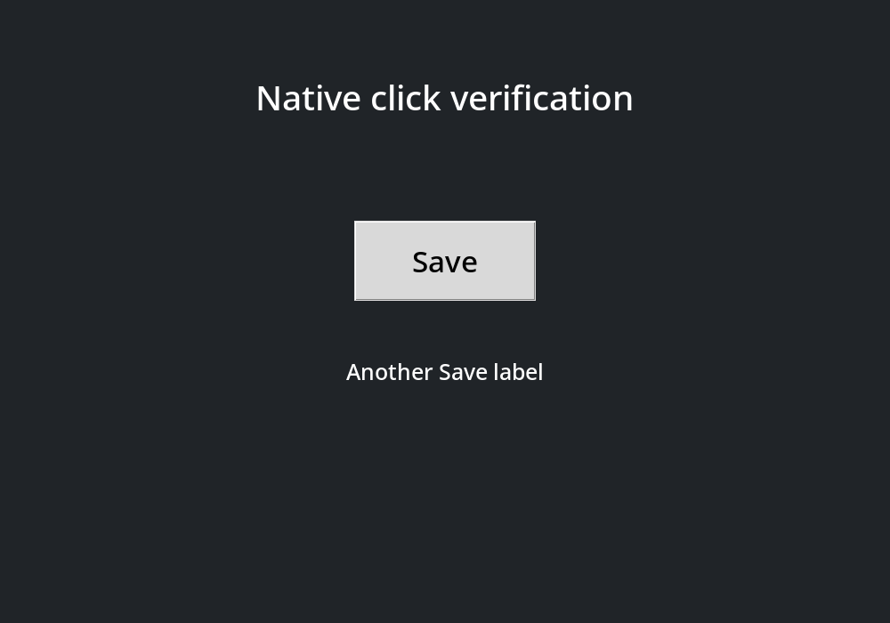

# computer-use

Native X11 desktop automation on a private virtual display, with local RapidOCR CPU text targets. Screenshots show letter-number badges; commands can query their coordinates or click their centers without browser instrumentation.

| Raw screenshot | OCR targets |
|---|---|
|  |  |

## Setup

Requires Linux, user systemd, Python 3, uv, Xvfb, xauth, xdpyinfo, xdg-dbus-proxy, ImageMagick, and xdotool. Clipboard commands additionally use xclip; the browser convenience uses helium-browser.

```bash
mkdir -p ~/.local/bin
ln -s "$PWD/scripts/computer_use.py" ~/.local/bin/computer-use
ln -s "$PWD/scripts/virtual_browser.py" ~/.local/bin/virtual-browser
computer-use setup-ocr
```

Use existing command links if already installed. `setup-ocr` creates a separate Python 3.12 environment under `~/.local/share/computer-use/ocr-venv` and prepares the pinned OCR models. Setup can download packages and model weights. Screenshot inference runs locally on CPU; images are never sent to an OCR service. Each desktop starts its own resident worker lazily and owns its cleanup.

## Capture, locate, click

```bash
computer-use start demo --size 1440x1000
computer-use launch demo --id app -- your-x11-app
computer-use screenshot demo --output /tmp/screen.png
# View the image, then choose a badge:
computer-use query demo @a13
computer-use click demo @a13
computer-use screenshot demo --output /tmp/after.png
computer-use stop demo
```

Screenshots print only the image path. The recognized text and geometry stay in the owner-only session directory. `query` prints one target as JSON: `ref`, `text`, `confidence`, `bounds`, `center`, and source-image information. Bounds are `[x1, y1, x2, y2]` with exclusive right/bottom edges; center is `[x, y]`, all in original screenshot pixels from the top left. These are OCR text bounds, not whole-control or accessibility bounds.

References advance through `@a1`, `@b1`, …, `@g1`, then wrap. A new capture replaces the reference map; all `input`, `exec`, launch/browser, clipboard-set, and click operations invalidate it. Queries do not invalidate it. A click checks the current pixels within its text box against the captured pixels before sending native input. A changed target rejects the click. Repeated letters are intentionally short visual hints, not globally unique capture IDs: always use the latest image, including after wraparound. Pixels alone cannot distinguish two logically different controls with identical appearance.

For unannotated images or targets that OCR misses:

```bash
computer-use screenshot demo --raw --output /tmp/raw.png
computer-use input demo -- mousemove 450 300 click 1
```

Raw capture clears references and does not require OCR. The existing input, clipboard, window, and browser commands remain available. See [SKILL.md](SKILL.md) for the complete desktop workflow and isolation boundaries.

## Development

```bash
python -m py_compile scripts/*.py
ruff check scripts
ruff format --check scripts
```

No GPU or cloud OCR runtime is required. The worker uses RapidOCR's detection/recognition boxes directly, clips them to the image, assigns labels in top-to-bottom/left-to-right order, and renders readable badges. Session input and screenshot publication are serialized with a file lock.
